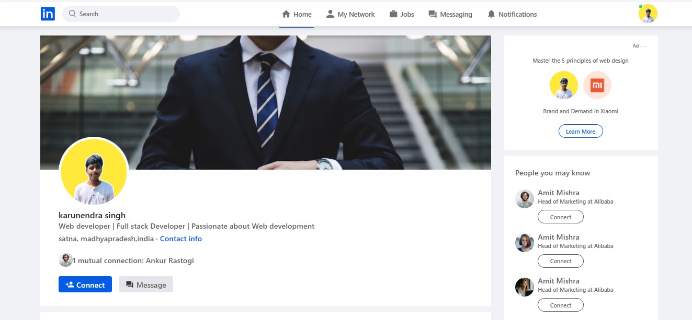

# 🔗 LinkedIn Clone 💼
🚀 A fully responsive front-end clone of LinkedIn built with **HTML, CSS, and JavaScript**.  
It mimics the layout of LinkedIn’s homepage — including the navbar, profile card, feed, and sidebar.  
Ideal for frontend practice and portfolio building! 🎯✨


## 🧑‍💻 User Interface Overview

<hr>



## ✨ Features

✅ Responsive navigation bar  
✅ Profile sidebar with user info  
✅ Clean newsfeed UI  
✅ Static layout – beginner-friendly  
✅ LinkedIn-inspired design  

## 🧰 Tech Stack

- 🌐 HTML5  
- 🎨 CSS3 (Flexbox & Grid)  
- 🧠 JavaScript (Vanilla JS)

### 📥 Clone the Repository
```bash
git clone https://github.com/karunendra91/Linkedin-clone.git

## 📁 Project Setup:
1. Clone this repo  
2. Run with Live Server (for frontend only)  


## 🙌 Author:
Karunendra Singh Patel  
🔗 LinkedIn: [linkedin.com/in/karunendra-patel-188250256](https://www.linkedin.com/in/karunendra-patel-188250256)


